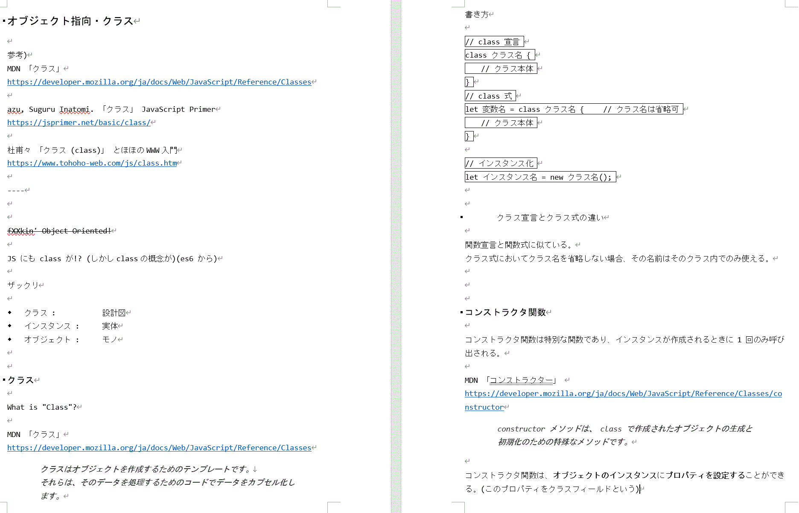
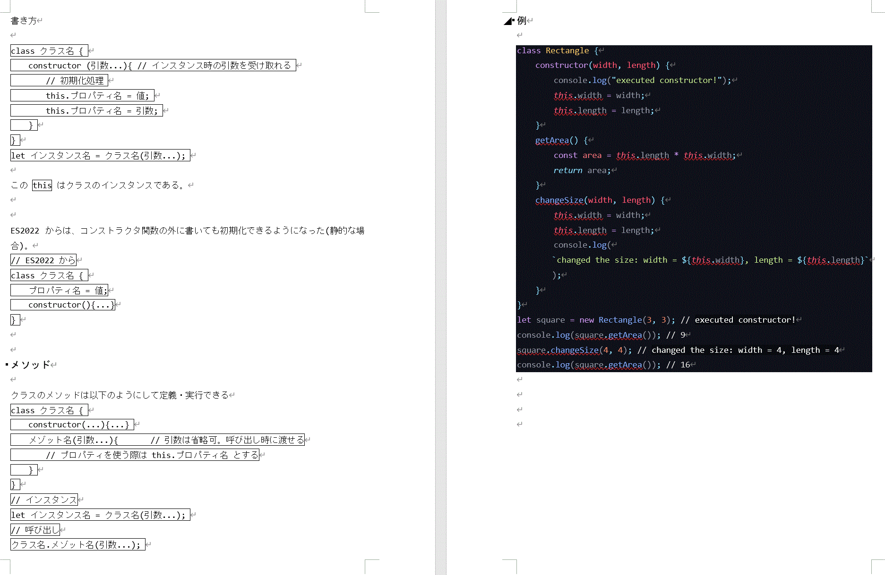

目次


# はじめに


# はじめのいっぽ


npm 関係

```PowerShell
> npm init
# package.json の作成

> npm install typescript
# typescript のインストール
```

ディレクトリ構造

```
project_name/
 |
 +- node_modules/	# node module のファイル
 |
 +- package-lock.json	# もとから
 +- package.json	# もとから
 |
 +- index.html		# 作成。 
 +- app.ts		# TypeScript のソースファイル。 これが "app.js" にコンパイルされる。
```

index.html
```HTML
<html>
<head>
  <title>Console_hello</title>
  <script src="./app.js" defer></script>  <!-- "app.ts" が "app.js" にコンパイルされる。 -->
</head>
<body>
</body>
```

app.ts
```TypeScript
let msg: string = "Hello World!";
console.log(msg);
```

コンパイル

```PowerShell
> npx tsc app.ts
```


ちなみにできた "app.js" は
```JavaScript
var msg = "Hello World!";
console.log(msg);
```
だった。


## はじめのいっぽ_ref

1. @eiji-noguchi "TypeScriptのインストールから実行まで" Qiita   
   (https://qiita.com/eiji-noguchi/items/8c1d3741ac9f2857b230)[https://qiita.com/eiji-noguchi/items/8c1d3741ac9f2857b230]

********
********
<br>

# 型 変数

TypeScript で型注釈のついた変数の宣言は
```TypeScript
let/const 変数名 : 型名 = 値; 
```
のようにする。


ちなみに `const` は必ず初期化されなくてはならず、以下のようにはできない。
```TypeScript
/* エラー!!!! */
const a : string;
a = "a";
/* tsc
src/app.ts:11:7 - error TS1155: 'const' declarations must be initialized.
11 const a : string;

src/app.ts:12:1 - error TS2588: Cannot assign to 'a' because it is a constant.
12 a = "a";
*/

/* 正しくは */
const a : string = "a";
```


## 型推論

TypeScript には Haskell などと同じように型推論がある。  
よって推論と異なるものを代入するとエラーになる。

```TypeScript
let x = 1;  // let x : number = 1 と推論される。 よって
/* エラーになる */
x = "abc";
/* tsc
error TS2322: Type 'string' is not assignable to type 'number'.

12 x = "abc";
   ~
*/
```

型推論は主に「初期化」や「パラメータのデフォルト値設定」「関数の戻り値決定」と言ったタイミングで行われる。

> This kind of inference takes place when **initializing variables and members**, **setting parameter default values**, and **determining function return types**.

(TypeScript. "Type Inference". Documentation.  [https://www.typescriptlang.org/docs/handbook/type-inference.html](https://www.typescriptlang.org/docs/handbook/type-inference.html), (cited: Mar. 13, 2023).)


## プリミティブ型

JS/TS の型はプリミティブ型とオブジェクト型がある。  
JS/TS のプリミティブ型はプロパティを持たず、また知っての通りイミュータブルである。   
ここら辺は EaGitro "Javascript_textbook.docs" の "Javascriptにおける「代入」「コピー」" でもみて。


プリミティブ型には以下のようなものがある。

* 論理型 `boolean` :
    * `true` or `false`
    * 
        ```TypeScript
        const bool : boolean = true;
        ```

* 数値型 `number` :
    * 整数や少数など。 IEEE 754の倍精度浮動小数である。
    * 
        ```TypeScript
        const num : number = -10.5;
        ```

* 文字列型 `string` :
    * 文字列リテラル。 `` ` `` を使ってテンプレート文字列もできる。
    * 
        ```TypeScript
        const str : string = `There is ${3*num} boats.`;
        ```

* null型 `null` :
    * null
    * 
        ```TypeScript
        const x : null = null;
        ```

* undefined型 `undefined` :
    * undefined
    * 
        ```TypeScript
        const x : undefined = undefined;
        ```

* シンボル型 `symbol` :
    * 必ず一意になる値。 宣言場所によって異なるものになる。 
    * 詳しくは 現代のJavaScriptチュートリアル."シンボル型". [https://ja.javascript.info/symbol](https://ja.javascript.info/symbol)
    * 下の `"description"` は説明用であり、なににも影響を与えないデバッグ用
        ```TypeScript
        const s : symbol = Symbol("description");
        ```


### リテラル型

リテラル型とは、プリミティブ型の特定の値だけを取るようにする変数である。  
後述のユニオン型と合わせて威力を発揮する。

```TypeScript
let one : 1;
one = 1;
// one = 100;   //エラーになる

// ユニオン型
// "Pochi" か "Taro" のみを取る
let dogs : "Pochi" | "Taro";
dogs = "Taro";
// dogs = "Tama"  // エラーになる
```
ちなみにコンパイル結果は
```JavaScript
let one;
one = 1;
let dogs;
dogs = "Taro";
```
のようになる。(型チェックされるためだけ??)


### プリミティブ型_ref
1. サバイバルTypeScript. "プリミティブ型 (primitive types)".   
   [https://typescriptbook.jp/reference/values-types-variables/primitive-types](https://typescriptbook.jp/reference/values-types-variables/primitive-types), (cited: Mar. 13, 2023).

2. サバイバルTypeScript. "リテラル型 (literal type)".   
   [https://typescriptbook.jp/reference/values-types-variables/literal-types](https://typescriptbook.jp/reference/values-types-variables/literal-types), (cited: Mar. 13, 2023).


<br>

## any型

any型はどのような型であっても代入を許可する型である。プリミティブもオブジェクトも関係ない。

```TypeScript
let v : any = 1;
v = "abc";  // OK!
v = {name: "obj"};  // OK!
```

また TypeScript コンパイラは、推論で結果が得られないとき、暗黙的にその変数等を any型 にする。
```TypeScript
let x;  // any型になる
```

any型 の変数にはコンパイラは型チェックを行わない。


### any型_ref
1. サバイバルTypeScript. "any型".   
   [https://typescriptbook.jp/reference/values-types-variables/any](https://typescriptbook.jp/reference/values-types-variables/any), (cited: Mar. 13, 2023).


<br>

## オブジェクト

TypeScript ではオブジェクトにも型注釈をすることができる。

```TypeScript
let/const 変数名 : { // このオブジェクトのようなもの自体が型注釈
  // 区切り文字は `;` か `,` (インラインでない場合は省略も可)
  プロパティ名 : 型名;
  プロパティ名 : 型名;

  // どちらでも書ける
  メソッド名(仮引数名 : 仮引数の型) : 戻り値の型;
  メソッド名 : (仮引数名 : 仮引数の型) => 戻り値の型; //メソッド名:アロー関数風
};
/* ここまで型注釈 */
変数名 = {
  // 区切り文字は `,` 
  プロパティ名: 値,
  プロパティ名: 値,

  // どちらでも書ける。
  メソッド: 無名関数/アロー関数,
  名前付き関数
  };  // 代入
```
型注釈があることでコンパイラが型チェックをしてくれる。

例)
```TypeScript
// 定義と型注釈
// 区切り文字は `;` `,`  インラインでないので無しでもいい
let obj : {
    num : number;
    str : string,

    method01(param_str : string) : number
    method02 : (param_bool : boolean) => boolean;
};

// 代入
// 区切り文字 `,` は必須
obj = {
    num : 1,
    str : "abc",    

    // 型注釈は省略も可. 省略しても上があるので型チェックしてくれる 
    // アロー関数で書くこともできる
    // method01: (param_str: string) : number => param_str.length,
    method01: function(param_str: string) : number{
        return param_str.length;
    },
    method02(param_bool){
        return !param_bool;
    }
}
```
また型注釈がなくても、初期化時に型推論される


### オブジェクトの変更

オブジェクトはミュータブルであって、変更可能である。  
(プリミティブ型は変更不可だが、参照先が変わることで変更可能なように見える)

`const` を使うことで、オブジェクト自体の変数は再代入不可になるが、オブジェクトのプロパティは変更可能である。

```TypeScript
const obj = { num: 1, str: "abc"};  // 型推論で {num: number; str: string} になる
obj.num = 2;  // OK!
// ちなみに obj.mun = "a"; はエラーになる。 
```
変更不可にするには、型注釈でオブジェクトのプロパティ毎に `readonly` をつける。

```TypeScript
const obj : {
    readonly num: number; // 変更不可
    str: string;          // 変更可
} 
= {num: 1, str: "abc"}
obj.num = 2; // エラーになる
```
これはプロパティごとにつけなければいけないことに注意する。  
再帰的には解釈しない。

### オプショナルプロパティ

オブジェクトで、そのプロパティがあってもなくても良いとする場合には、  
型注釈でプロパティ名に `?` をつけて、`プロパティ名?` とする。
```TypeScript
const obj : {
  num: number;      // 必須
  str: string;      // 必須
  bool?: boolean;   // あってもなくても良い
} 
= {num: 1, str: "abc"} // OK!
```

### オブジェクトのプロパティの追加(インデックスシグネチャ)

TypeScript では、オブジェクトの型は  
`{プロパティ名: 値の型; ... }` のセットである。

また型注釈がなかったとしても、初期化時に型推論されるため、後からオブジェクトのプロパティを追加することはそのままではできない。
```TypeScript
const obj = {num: 1, str: "abc"};   // {num: number; str: string} と推論される
/* JSではOKだが、TSではエラーになる */
obj.bool = true; // エラー: プロパティ 'bool' は型 {num: number; str: string} には存在しません。
```

これを回避するには **インデックスシグネチャ** を使う.

JS では、オブジェクトのプロパティにアクセスするとき、配列にインデックスでアクセスするのと同じように
```JavaScript
// アクセス
オブジェクト名["プロパティ名"]
```
でアクセスできた。

これと同じように、以下のようにインデックスシグネチャを使えば、  
プロパティ名を指定せず値の型のみを指定するプロパティの型を設定でき、  
その型のプロパティを何個も設定・追加することができる。  

```TypeScript
let オブジェクト名: {
  [型変数名: インデックスの型]: 値の型;
}
```
**インデックスの型** には「数値型」「文字列型」「シンボル型」を設定できる

[型変数について]()
<!-- TODO: 型変数についての説明 -->

また、インデックスシグネチャ以外にも個々のプロパティを設定できるが、  
値の型はインデックスシグネチャの値の型と同じである必要がある。  
その場合には、そのプロパティは必須になる.


例）

```TypeScript
let onlyNum: {
    // x: string; // err. 型 'string' はダメ
    n: number; // OK!
    [K: string]: number;
} = {
    n: 3, // n は必須
    abc: 4
}; 
onlyNum.m = 4; // OK!
```

### オブジェクト_ref
1. サバイバルTypeScript. "オブジェクトの型注釈 (type annotation)".   
   [https://typescriptbook.jp/reference/values-types-variables/object/type-annotation-of-objects](https://typescriptbook.jp/reference/values-types-variables/object/type-annotation-of-objects), (cited: Mar. 13, 2023).

2. サバイバルTypeScript. "オブジェクト型のreadonlyプロパティ (readonly property)".   
   [https://typescriptbook.jp/reference/values-types-variables/object/readonly-property](https://typescriptbook.jp/reference/values-types-variables/object/readonly-property), (cited: Mar. 14, 2023).

3. サバイバルTypeScript. "オブジェクト型のオプションプロパティ (optional property)".   
   [https://typescriptbook.jp/reference/values-types-variables/object/optional-property](https://typescriptbook.jp/reference/values-types-variables/object/optional-property), (cited: Mar. 14, 2023).


1. sjbworks. "TypeScriptとインデックスシグネチャの話". Zenn.  
   [https://zenn.dev/sjbworks/articles/b8bc7d7bacfd07](https://zenn.dev/sjbworks/articles/b8bc7d7bacfd07), (cited: Mar. 14, 2023).

2. TypeScript. "Object Types".   
   [https://www.typescriptlang.org/docs/handbook/2/objects.html#index-signatures](https://www.typescriptlang.org/docs/handbook/2/objects.html#index-signatures), (cited: Mar. 16, 2023).


<br>

## 配列

TypeScript でも配列を扱うことができる。  
しかしながら、配列の要素にも型はついてまわる。

以下の例では `let arr = [1, "b"]` としているため、TypeScript が `arr: (string | number)[]` と型推定している。  
そのためこの配列には、`string` と `number` しか入れることはできない。
```TypeScript
let arr = [1,"b"];  // arr: (string | number)[]
// arr[3] = true;   // エラー。 論理型は入れることはできない。
```

また、初期化時に型注釈をすることができる。型注釈をするには以下の2つの方法がある。
```TypeScript
let/const 配列名: 型名[];
let/const 配列名: Array<型名>;
```
2つ以上の型を指定することもできる。
```TypeScript
let/const 配列名: (型名 | 型名)[]; // この括弧は必須。ないと `型名` or `型名[]` の意味になる
let/const 配列名: Array<型名 | 型名>;
```

例)
```TypeScript
let numOrStrArr: (number | string)[] = [0, "b"];
let boolOrNumArr: Array<bool | number> = [true, 1, 2];
```

2つに違いはない。


### 配列_ref

1. masanyon. "【TypeScript入門】多次元配列や複数の型を持つ配列など配列の書き方まとめ". No Change No Life I/O.  
   [https://masanyon.com/typescript-%E5%A4%9A%E6%AC%A1%E5%85%83%E9%85%8D%E5%88%97-%E8%A4%87%E6%95%B0%E3%81%AE%E5%9E%8B/](https://masanyon.com/typescript-%E5%A4%9A%E6%AC%A1%E5%85%83%E9%85%8D%E5%88%97-%E8%A4%87%E6%95%B0%E3%81%AE%E5%9E%8B/), (cited: Mar. 16, 2023).


<br>

## タプル

TypeScript には tuple がある。

タプルも配列と同様に複数の値を保持できるが、 **インデックスごとに型を設定できる** ことが特徴である。  
また**要素の数も決まっている**。

```TypeScript
let/const タプル名: [0番目の型, 1番目の型, 2番目の型, ...];
```
例)
```TypeScript
let t: [string, number];
t = ["a", 1];     // OK!
t = ["hoge", 13]; // OK!   
// t = [0, "a"];  // エラー. [string, number] の順である必要がある
// t = ["a"]      // エラー. 長さは 2 でなくてはならない
```

また、タプルを使うと、**関数で複数の値を返す** ことができる。  
配列を使おうとすると、戻り値の型で `any型` などを指定せざるを得ず、要素数もチェックすることが難しい。  
しかしタプルを使うことでこれらの問題が解決される。

加えて、タプルは **分割代入** をすることができる。

```TypeScript
function retTuple(): [string, number, boolean] {
    // 何らかの処理
    return ["abc", 3, true];
}
/* 分割代入 要らない項目はぬかして `,` を書く */
let [str, , bool] = retTuple(); 
/* もちろん普通の代入も可。 */
let newTuple = retTuple(); 
```

JS では普通の配列になる。

またタプルは、ジェネリクスなどの場面では `Array<型名>` として扱うことができる。

```TypeScript
function len<T extends Array<any> | string> (param: T): number {
    return param.length;
}

let myTuple: [boolean, number, number] = [true, 3, 24]; 
let tupleLen = len<Array<boolean | number>>(myTuple);   // 3
// myTuple は [boolean, number, number] なので Array<boolean | number> となる。
```


### タプル_ref

1. まくろぐ. "TypeScriptの型: タプルを定義する (Tuple types)".  
   [https://maku.blog/p/6uzqf4q/](https://maku.blog/p/6uzqf4q/), (cited: Mar. 16, 2023).

2. サバイバルTypeScript. "タプル (tuple)".   
   [https://typescriptbook.jp/reference/values-types-variables/tuple](https://typescriptbook.jp/reference/values-types-variables/tuple), (cited: Mar. 16, 2023).

<br>

## enum

JavaScript にはないが、TypeScript には enum (列挙型) がある。   

列挙型では、特に指定しなければ、 0 から順番に値が割り振られる。

```TypeScript
// 定義
enum 列挙型名 {
  メンバー名,   // = 0
  メンバー名,   // = 1
  メンバー名,   // = 2
  ...
}

// 代入
let 変数 = 列挙型名.メンバー名;
```

例えば以下のような場合、

```TypeScript
enum Dogs {
    Pochi,  // = 0
    Taro,   // = 1
    Saburo  // = 2
}
let my_dog = Dogs.Pochi;  // 0
```
以下のような JS になって出力される。

```TypeScript
/* JavaScript */
var Dogs;
(function (Dogs) {
    Dogs[Dogs["Pochi"] = 0] = "Pochi";
    Dogs[Dogs["Taro"] = 1] = "Taro";
    Dogs[Dogs["Saburo"] = 2] = "Saburo";
})(Dogs || (Dogs = {}));
let my_dog = Dogs.Pochi;
```
全体で、**無名関数** になっている。   

1. `dogs[dogs["Pochi"] = 0] = "Pochi"`
    1. 内側の `dogs["Pochi"] = 0` で、 オブジェクト "dogs" の "Pochi" に 0 を代入している。
    2. JS では、**代入演算子は代入した値を返す** ので、外側は `dogs[ /*dogs["Pochi"] = 0*/ 0 ] = "Pochi"` すなわち `dogs[0] = "Pochi"` である
    3. 結果、オブジェクトとして、`dogs: { Pochi: 0, 0: Pochi}` というオブジェクトができる。これを3つ分。

1. `(dogs || (dogs = {}))`
    1. 即時実行関数の `(function (){ ... })(/* here! */)` 
    2. OR 演算子 `||` は **短絡評価** であるため、先に `dogs` が真(つまり、オブジェクトが存在する)であれば、`(dogs = {})` は評価されないため、実行されない。
    3. しかし、`dogs` が偽(つまり、オブジェクトが存在しない)であれば、`(dogs = {})`が実行され、オブジェクトが作られる。
    4. その結果、空の列挙型を作っても問題なく動くのである。

結果できたオブジェクトは

```TypeScript
Object { 0: "Pochi", 1: "Taro", 2: "Saburo", Pochi: 0, Taro: 1, Saburo: 2 }
|   0: "Pochi"
|   1: "Taro"
|   2: "Saburo"
|   Pochi: 0
|   Saburo: 2
|   Taro: 1
```
である。

<br>

また、TypeScript では、連番の開始を変更することや、識別子に文字列を使うこともできる。   
例)  

連番の開始
```TypeScript
enum Cats{
    Tama = 4,   // = 4
    Mugi,       // = 5
    Kinako      // = 6
}
console.log(Cats);
/* Object { 4: "Tama", 5: "Mugi", 6: "Kinako", Tama: 4, Mugi: 5, Kinako: 6 } */
```

文字列
```TypeScript
enum Fruits{
    Apple = "RINGO",
    Banana = "BANANA",
    Orange = "MIKAN"
}
console.log(Fruits);
/* Object { Apple: "RINGO", Banana: "BANANA", Orange: "MIKAN" } */

// JavaScript
(function (Fruits) {
    Fruits["Apple"] = "RINGO";
    Fruits["Banana"] = "BANANA";
    Fruits["Orange"] = "MIKAN";
})(Fruits || (Fruits = {}));
```
文字列の場合はただの文字列がキーになったオブジェクトになるのである。


### enum_ref

1. TypeScript Deep Dive 日本語版. "Enum".   
     [https://typescript-jp.gitbook.io/deep-dive/type-system/enums](https://typescript-jp.gitbook.io/deep-dive/type-system/enums), (cited: Mar. 18, 2023).


<br>

## ユニオン型

ユニオン型は「いずれかの型」を表すことができる。   

```TypeScript
let 変数名:  型A | 型B | 型C | ... ;    
```

これで 変数名 は 型A、型B、型C、... のいずれかの型を持つことができる

```TypeScript
let strOrNumArr: (string | number)[];   // string か number が入る配列
```

また、リテラル型と合わせて使うことができる。
```TypeScript
let oneOrTrue = 1 | true;       // 1 か true のみ許容
```


### ユニオン型_ref

1. サバイバル TypeScript. "ユニオン型 (union type)".   
     [https://typescriptbook.jp/reference/values-types-variables/union](https://typescriptbook.jp/reference/values-types-variables/union), (cited: Mar. 18, 2023).


## 型エイリアス

TypeScript には型に別名(エイリアス)をつけることができる。     
タプルやオブジェクトなどにも使うことができる。

ユニオン型と合わせて使うこともできる。 `=` を使うことに注意。

```TypeScript
type 新しい型の名前 = 既存の型;     
```

例)     
```TypeScript
type StrOrNum = string | number;    // string か number のみ許容する
let newArr: Array<StrOrNum> = ["abc", 32];


type StrTuple = [string, string];   // tuple の型定義
let newTuple: StrTuple = ["abc", "efg"];    // [string, string] の tuple


let DefObj = {      // オブジェクトの型注釈・定義をした型エイリアス
    str: string;
    num: number;
};
let newObj: DefObj = {
    str: "abc",
    num: 12
}
```


### 型エイリアス_ref

1. サバイバル TypeScript. "型エイリアス (type alias)".   
     [https://typescriptbook.jp/reference/values-types-variables/type-alias](https://typescriptbook.jp/reference/values-types-variables/type-alias), (cited: Mar. 19, 2023).


<br>


## オブジェクト定義の結合

`&` を使うと、オブジェクトの定義を結合することができる。

```TypeScript
type DefObj1 = {
    str: string;
    num: number;
};

type DefObj2 = {
    bool: boolean;
} & {
    undef: undefined;
};

type NewDefObj = DefObj1 & DefObj2; 
// 定義は {str: string; num: number; bool: boolean; undef: undefined} 

let newObj: NewDefObj = {
    str: "abc",
    num: 13,
    bool: true,
    undef: undefined
}
```

### ブジェクト定義の結合_ref

1. サバイバル TypeScript. "typeof型演算子".   
     [https://typescriptbook.jp/reference/type-reuse/typeof-type-operator](https://typescriptbook.jp/reference/type-reuse/typeof-type-operator), (cited: Mar. 19, 2023).


## typeof型演算子

TypeScript には JavaScriptのtype演算子 とは別に typeof型演算子 がある。

これを使えば、変数から型を抽出することができる。

```TypeScript
type 抽出先の型エイリアス =  typeof 変数;
```
例)

```TypeScript
let newObj = {
    str: "abc",
    num: 13
}
type ExtractedObjDef = typeof newObj;
/* ExtractedObjDef
{
    str: string;
    num: number;
}
*/
```

### typeof型演算子_ref

1. サバイバル TypeScript. "typeof型演算子".  
     [https://typescriptbook.jp/reference/type-reuse/typeof-type-operator](https://typescriptbook.jp/reference/type-reuse/typeof-type-operator), (cited: Mar. 19, 2023).


<br>


## 型アサーション

TypeScript では、コンパイラが型推論をしてくれる。

しかし、ユーザがこれを上書きすることもできる。これが型アサーションである。

以下はサバイバルTypeScript. "型アサーション「as」(type assertion)".   
     [https://typescriptbook.jp/reference/values-types-variables/type-assertion-as](https://typescriptbook.jp/reference/values-types-variables/type-assertion-as), (cited: Mar. 25, 2023).

> 型アサーションを用いるとコンパイラーに型を伝えることができます。型アサーションはコンパイラに「私を信じて！私のほうが型に詳しいから」と伝えるようなものです。


```TypeScript
(型アサーションしたい変数 as ユーザが思う型).適用したいメソッド等    // 但し一時的にしか信じてくれない。また信じこませるには再度する必要がある。
```


例)
```TypeScript
let thisIsStr: string | null;   
function retStr(str: string | null = null){
    return str;                 // この時点では string か null が帰る
}
thisIsStr = retStr("abc");      // null である可能性がある
// thisIsStr.length;            // 'thisIsStr は null の可能性があります'
(thisIsStr as string).length    // 絶対 文字列入るから大丈夫 信じて!!!! '今回だけですよ'
thisIsStr;                  // thisIsStr: string | null また戻った
```


しかし、無理な型アサーションはエラーになることがある。


### 型アサーション_ref

1. サバイバルTypeScript. "型アサーション「as」(type assertion)".   
     [https://typescriptbook.jp/reference/values-types-variables/type-assertion-as](https://typescriptbook.jp/reference/values-types-variables/type-assertion-as), (cited: Mar. 25, 2023).


## 制御フローによる型の絞り込み

TypeScript の型推論は賢いので、制御フローを設けることで型を絞り込むことができる。  

```TypeScript
function fun(param: number | string){   // param: number | string
    param.length;  // number になる可能性があるので、エラー
}

// 制御フローを設ける
function fun(param: number | string) {  // param: number | string
    if (typeof param === "string") {    // param: string になるため
        param.length;  // エラーにならない。
    }
}
```

### typeof 演算子について
JavaScript には typeof 演算子があり、型の名前を **文字列** で返す。

```javascript
typeof 12       // 'number'
typeof "abc"    // 'string' 
typeof true     // 'boolean'
typeof [1,"abc"]            // 'object'
typeof {a: "a"}             // 'object'
mydate = new Date();
typeof mydate               // 'object'         インスタンスは 'object'
typeof null                 // 'object'         null は 'object' になることに注 !!
typeof function (){}        // 'function'
typeof class Myclass {}     // 'function'
typeof undefined            // 'undefined'
var a;
typeof a                    // 'undefined'      初期化前の変数は undefined
// ただし TypeScript では、初期化前に変数を使うことはできない。
```

### 制御フローによる型の絞り込み_ref

1. サバイバルTypeScript. "制御フロー分析と型ガードによる型の絞り込み".   
     [https://typescriptbook.jp/reference/statements/control-flow-analysis-and-type-guard](https://typescriptbook.jp/reference/statements/control-flow-analysis-and-type-guard), (cited: Mar. 27, 2023).


## テンプレートリテラル型

JS/TS では **テンプレートリテラル** (文字列の中で変数を展開できる)が使える。  
```TypeScript
// Template literal
`${変数}文字列`
// 例
const hoge = "hoge";
const i = 0
console.log(`${hoge}-${i}`); /* hoge-0 */
```

何とこれを使って、 TypeScript では **動的にリテラル型を作成することができる** らしい。(ただし、動的と言っても for 文で回すとかは技術的に不可能である。多分そういうことを意識しているわけではないと思う)

```TypeScript
type HogeHuga = "hoge" | "huga";    /* type であることに注意 */
type I = number;                    /* type であることに注意 */
type HogeHugaNum = `${HogeHuga}-${I}`;
// type HogeNum = `hoge-${number}` | `huga-${number}`
```

### テンプレートリテラル型_ref

1. @acro5piano. "TypeScript 4.1 の Template Literal Types がやばい". Qiita.  
     [https://qiita.com/acro5piano/items/5787b9133f7433040085](https://qiita.com/acro5piano/items/5787b9133f7433040085), (cited: May 05, 2023).


******

# ジェネリクス

ジェネリクスを使うことで、型によらないオブジェクト、クラス、関数を作成することができる。

型を概念化して、型も引数として考えるのである。(型引数)

```TypeScript
/* 関数の場合 */
function 関数名<型変数名> (/* パラメータにも型変数を使うことができる.例) param: 型変数名 */) /* 戻り値の型も同様 */ {
    // 例　let 変数: 型変数名 = 値;
}
```

また `extends` (継承) を使って、型引数に制約を与えることができる。    
これがあることで TypeScript は、その引数に対してメソッドを適用できるかを知ることができる。    
複数の制約を与える場合には `extends 型名 | 型名 |...` とする。

```TypeScript
function 関数名<型変数名 extends 型名 | 型名 | ...>(...) {
    ...
}
```


例)
```TypeScript
/* 関数で型ごとに一つ一つ使う場合 */
function lenArr (param: Array<any>): number {
    return param.length;
}
function lenStr (param: string): number {
    return param.length
}

/* ジェネリクスを使って共通化 */
function len<T extends Array<any> | string> (param: T): number {
    return param.length;
}
/* extends を使わないと */
/* コンパイルエラーに
function len <T>(param: T): number {
    return param.length;        // プロパティ 'length' は、型 'T' に存在しません
}
*/

/* 使用 */

let strLen = len<string>("abc");    // 3
let arrLen = len<Array<boolean | number>>([1, 2, true]);    // 3
let myTuple: [boolean, number, number] = [true, 3, 24];     // tuple も Array
let tupleLen = len<Array<boolean | number>>(myTuple);       // 3
/* 関数の場合、明示的な場合は型推論されるので、ジェネリクスがなくてもいい */
let strLen2 = len("abc");
```


* [ ] **TODO:**
    * [ ] なぜこれがエラーなのか調べる
        ```TypeScript
        function plusTwoParam<T extends string | number>(param1: T, param2: T) {
            return param1 + param2;
        }    
        ```
        `extends string` のみ `extends number` のみなら上手くいくのに...


## ジェネリクス_ref

1. サバイバルTypeScript. "型引数の制約".   
     [https://typescriptbook.jp/reference/generics/type-parameter-constraint](https://typescriptbook.jp/reference/generics/type-parameter-constraint), (cited: Mar. 20, 2023).


******

# 型情報の export

型定義ファイルでなくとも、型情報は別ファイルに分けることができる。　　
```TypeScript
/**
 *  export 側
 */
export type 型名1 = 型情報;
export type 型名2 = 型情報;

/**
 *  import 側
 */
import {型名1, 型名2} from 'ファイルパス'

let hoge: 型名1 = huga;
```
******

# 関数

関数の型注釈は

```TypeScript
function 関数名(仮引数: 仮引数の型名, ... ): 戻り値の型名{      // 戻り値がない場合は void
    // 処理
    return 戻り値;
}


// アロー関数
let 関数名 = (仮引数: 仮引数の型名, ... ): 戻り値の型名 => 戻り値;

// アロー関数の型宣言
type 型名 = (引数名: 引数の型, ... ) => 戻り値の型;
// 型宣言を使用した型注釈
let 関数名: 型名 = (引数名, ... ) => 戻り値;
```

例)
```TypeScript
function declareFunc(strParam: string, numParam: number): void{
    console.log(strParam, numParam)
}
declareFunc("abc", 23);

type typeOfFunc = (strParam: string) => number;
let arrowFunc: typeOfFunc = (strParam) => strParam.length;
let strLen = arrowFunc("abcd");
```

## デフォルト引数

引数が `undefined` である場合に代入する、デフォルトの値を設定できる。  
デフォルト値がある場合、引数は省略できる。


```TypeScript
function 関数名(引数名: 型名 = デフォルト値, ... ){
    // 処理
}

関数名(/* デフォルト値がある場合、引数は省略できる */);
```
例)

```TypeScript
function myFunc(param = "Hello") {
    console.log(param);
}
myFunc();       // 引数は省略可
```

### デフォルト引数_ref

1. サバイバルTypeScript. "デフォルト引数 (default parameter)".   
     [https://typescriptbook.jp/reference/functions/default-parameters](https://typescriptbook.jp/reference/functions/default-parameters), (cited: Mar. 22, 2023).


## オプショナル引数

引数に `?` をつけると、実行時にその引数を受け取れるか選択できる。

オプショナル引数にすると、`undefined` とのユニオン型となる。そのためにエラーが起こることがある。     
(`undefined` に対して適用できない演算はエラーに)
```TypeScript
function 関数名(引数名?: 型名, ... ){   // 引数名の型は ` 引数名: 型名 | undefined `
    // 処理
}
```
例)
```TypeScript
function greet(greeting?: string){     // greeting: string | undefined
    /* undefined は length プロパティを持っていないため、エラー */
    return greeting.length; // ERROR
}
```

これを防ぐには、`undefined` の際に条件分けする。
```TypeScript
function greet(greeting?: string){
    if(typeof === "undefined"){     // この typeof 演算子は JavaScript の演算子。型の文字列を返す。
        greeting = "";
    }
    return greeting.length;
}
```

もしくは **デフォルト引数** を使えば同様のことができる。(デフォルト引数が設定されている場合は引数は省略可)
```TypeScript
function greet(greeting: string = "Hello"){
    return greeting.length;
}
```

### オプショナル引数_ref

1. サバイバルTypeScript. "オプション引数 (optional parameter)".   
     [https://typescriptbook.jp/reference/functions/optional-parameters](https://typescriptbook.jp/reference/functions/optional-parameters), (cited: Mar. 22, 2023).

<br>

*******
# オブジェクト指向


まずは JS のオブジェクト指向について

EaGitro "Javascript_textbook.docs" の "オブジェクト指向・クラス" についてを参照






## クラス

クラスの書き方

```TypeScript
// class 宣言
class クラス名 {
    // フィールドは必ずここに書かなくてはいけない。コンストラクタ関数で初期化する場合も。
    フィールド・プロパティ名: 型名;
    フィールド・プロパティ名: 型名 = 値;    // デフォルト値を書くことができる.
    ...

    constructor(コンストラクタ引数: 型名, ... ) {   // コンストラクタ関数は省略可。但しフィールドがある場合、初期化する必要がある。
        // 処理
    }

    メソッド名(引数名: 型名, ... ){
        // 処理
    }
}

// インスタンス化
let インスタンス名 = new クラス名(コンストラクタ引数, ... );

// メソッドの使用
インスタンス名.メソッド名(メソッド引数);
```


例)
```TypeScript
class Rectangle {
    name: string = "rectangle";
    width: number;
    length: number;
    constructor(width: number, length: number, name: string) {
        this.width = width;
        this.length = length;
        this.name = name;
    }
    getArea(): number {
        return this.width * this.length;
    }
    changeArea(width: number, length: number): void {
        this.width = width;
        this.length = length;
        console.log(
            `new size is {width: ${this.width}, length: ${this.length}}`
        )
    }
}

let mySquare = new Rectangle(3, 3, "mySquare");
console.log(mySquare.getArea()); // 9
mySquare.changeArea(4, 4);  // new size is {width: 4, length: 4}
```


### クラス_ref

1. サバイバルTypeScript. "コンストラクタ (constructor)".   
     [https://typescriptbook.jp/reference/object-oriented/class/constructor](https://typescriptbook.jp/reference/object-oriented/class/constructor), (cited: Mar. 21, 2023).

2. サバイバルTypeScript. "フィールド (field)".   
     [https://typescriptbook.jp/reference/object-oriented/class/fields](https://typescriptbook.jp/reference/object-oriented/class/fields), (cited: Mar. 21, 2023).

3. サバイバルTypeScript. "メソッド (method)".   
     [https://typescriptbook.jp/reference/object-oriented/class/methods](https://typescriptbook.jp/reference/object-oriented/class/methods), (cited: Mar. 21, 2023).

1. @yukiji. "知識ゼロから始めるTypeScript 〜クラス編〜". Qiita.  
     [https://qiita.com/yukiji/items/3db06601ece7f080b0d0](https://qiita.com/yukiji/items/3db06601ece7f080b0d0), (cited: Mar. 21, 2023).

<br>


## 継承

継承とは、あるクラス(継承元・superClass)のメソッド・プロパティを引き継いで新たなクラス(継承先・subClass)を作ること。

継承のさい、**継承先** のコンストラクタ関数は `constructor()` で定義でき、**継承元** のコンストラクタ関数は `super()` で呼び出すことができる。

```TypeScript
class 継承先 extends 継承元 {
    constructor(コンストラクタ引数: 型名, ... ){
        // 継承先のコンストラクタ
    }

    super(継承元のコンストラクタ引数: 型名); // 継承元のコンストラクタを呼び出す
}
```

例)
```TypeScript

// 継承元のクラス
class Rectangle {
    name: string = "rectangle";
    width: number;
    length: number;
    constructor(width: number, length: number, name: string) {
        this.width = width;
        this.length = length;
        this.name = name;
    }
    getArea(): number {
        return this.width * this.length;
    }
    changeArea(width: number, length: number): void {
        this.width = width;
        this.length = length;
        console.log(
            `new size is {width: ${this.width}, length: ${this.length}}`
        )
    }
}

// 継承先のクラス
class Cuboid extends Rectangle {
    height: number;

    constructor(width: number, length: number, height: number, name: string) {
        super(width, length, name);     // Rectangle のコンストラクタ関数を呼び出す。
        this.height = height;
    }

    getVolume(): number {
        return this.getArea() * this.height;    // メソッドを使うときも this を使う
    }
    changeVolume(width: number, length: number, height: number){
        this.height = height;
        this.changeArea(width, height);
        console.log(`and 'height' was changed into ${this.height}.`);
    }

    getSize(): void{
        console.log(
            `size:
            { width: ${this.width}, length: ${this.length}, height: ${this.height} }`
        )
    }
}

let myCuboid = new Cuboid(3, 3, 6, "myCuboid");
console.log(myCuboid.getVolume());  // 54
console.log(myCuboid.getArea());    // 9    継承元の Rectangle のメソッドも使える。
myCuboid.changeVolume(4, 4, 2);     // new size is {width: 4, length: 2} and 'height' was changed into 2.
console.log(myCuboid.getSize());    // size: { width: 4, length: 2, height: 2 }

```


### 継承_ref

1. サバイバルTypeScript. "クラスの継承 (inheritance).   
     [https://typescriptbook.jp/reference/object-oriented/class/class-inheritance](https://typescriptbook.jp/reference/object-oriented/class/class-inheritance), (cited: Mar. 22, 2023).

<br>


## アクセス修飾子

アクセス修飾子を使うことで、メソッドやプロパティにアクセスできる範囲を制限できる。  


| アクセス修飾子 | 説明                                             |
| -------------- | ------------------------------------------------ |
| public         | どこからでもアクセスできる。宣言しないのと同様   |
| protected      | 自分と自身を継承したサブクラスのみがアクセス可能 |
| private        | 自分のみアクセス可能                             |


```TypeScript

// 継承元のクラス
class Rectangle {
    /* アクセス修飾子 */
    private name: string = "rectangle";     // Rectangle からのみアクセスできる。
    protected width: number;                // Rectangle とそれを継承したクラスのみアクセス可
    protected length: number;               // Rectangle とそれを継承したクラスのみアクセス可
    constructor(width: number, length: number, name: string) {
        this.width = width;
        this.length = length;
        this.name = name;
    }
    protected getArea(): number {           // メソッドにも適用できる
        return this.width * this.length;
    }
    changeArea(width: number, length: number): void {
        this.width = width;
        this.length = length;
        console.log(
            `new size is {width: ${this.width}, length: ${this.length}}`
        )
    }
}

// 継承先のクラス
class Cuboid extends Rectangle {
    public height: number;

    constructor(width: number, length: number, height: number, name: string) {
        super(width, length, name);
        this.height = height;
    }

    getVolume(): number {
        return this.getArea() * this.height;    // メソッドを使うときも this を使う
    }
    changeVolume(width: number, length: number, height: number){
        this.height = height;
        this.changeArea(width, height);
        console.log(`and 'height' was changed into ${this.height}.`);
    }
    getSize(): void{
        console.log(
            `size:
            { width: ${this.width}, length: ${this.length}, height: ${this.height} }`
        )
    }

    // new
    getName(): void{
        /* name は private なので Rectangle からでしかアクセスできない */
        console.log(this.name);     // ERROR
    }
}

let myCuboid = new Cuboid(3, 3, 6, "myCuboid");
console.log(myCuboid.height);   // 6    height は public なのでクラスの外からでもアクセス可
console.log(myCuboid.getArea());    // getArea() は private なので 継承先以外の外部からはアクセスできない


```


### アクセス修飾子_ref
1. サバイバルTypeScript. "アクセス修飾子 (access modifier)".   
     [https://typescriptbook.jp/reference/object-oriented/class/access-modifiers](https://typescriptbook.jp/reference/object-oriented/class/access-modifiers), (cited: Mar. 22, 2023).


<br>

********

# interface

TODO: Introduce interfaces

********
********

# Notes


*******
## 環境構築


### TypeScriptのみ

```PowerShell
> npm init 

> npm install --save-dev typescript
```

<br>

`tsconfig.json` 　の設定。  

```PowerShell

# tsconfig.json をつくる

> npx tsc --init

Created a new tsconfig.json with:                                                                                                                     TS
  target: es2016
  module: commonjs
  strict: true
  esModuleInterop: true
  skipLibCheck: true
  forceConsistentCasingInFileNames: true
You can learn more at https://aka.ms/tsconfig
```

このままデフォルト(`> npx tsc`)の場合.

1. **カレントディレクトリから親ディレクトリの順に `tsconfig.json` を探してくる。**  
    > By invoking tsc with no input files, in which case the compiler searches for the tsconfig.json file starting in the current directory and continuing up the parent directory chain.
   
    TypeScript. "What is a tsconfig.json". TypeScript Documentation.  
    [https://www.typescriptlang.org/docs/handbook/tsconfig-json.html](https://www.typescriptlang.org/docs/handbook/tsconfig-json.html), (cited: Mar. 13, 2023).

1. **`tsconfig.json` があるディレクトリがルートになる。**  
    > The presence of a tsconfig.json file in a directory indicates that the directory is the root of a TypeScript project.

    TypeScript. "What is a tsconfig.json". TypeScript Documentation.  
    [https://www.typescriptlang.org/docs/handbook/tsconfig-json.html](https://www.typescriptlang.org/docs/handbook/tsconfig-json.html), (cited: Mar. 13, 2023).
   
1. **ファイルの指定等がないデフォルトの場合は、全ての `.ts` ファイルがコンパイルされる。**
    > This way TypeScript will include all the .ts files in this directory (and sub directories) as a part of the compilation context.

    TypeScript Deep Dive. "tsconfig.json".   
    [https://basarat.gitbook.io/typescript/project/compilation-context/tsconfig](https://basarat.gitbook.io/typescript/project/compilation-context/tsconfig), (cited: Mar. 13, 2023).


コンパイル対象のファイルを設定するには `"include":[]` を指定する。

`"include":[]` は `"compilerOptions":{}` ***ではない*** ことに注意する。

ワイルドカードを使って指定できる。
```JSON
// 例 `src/` 以下にある全てのディレクトリとファイルにマッチする
{
  "include":["src/**/*"],
}
```
以下は [TypeScript. "Compiler Options".](https://www.typescriptlang.org/ja/tsconfig#include) より

>includeとexcludeはグロブパターンのためのワイルドカードをサポートしています:
>
> * `*` ゼロ個以上の文字列にマッチ（ディレクトリセパレータは除く）
> * `?` 任意の 1 文字にマッチ（ディレクトリセパレータは除く）
> * `**/` 任意階層の任意ディレクトリにマッチ  
> 
> グロブパターンがファイルの拡張子を含まない場合、サポートされる拡張子のみが含まれるようになります（例：.ts、.tsxと.d.tsはデフォルトでインクルードされ、.jsと.jsxはallowJsが設定された場合のみインクルードされます）。

<br>

**次に出力ファイルの設定をする。**  
TypeScript は基本的に、コンパイル対象(ts)のディレクトリ構造と同じになるように、出力構造を決定する。

出力ファイルの設定は `"compilerOptions":{}` の中に記入される。

* `"outDir":`
    * 出力先のディレクトリを指定する。この中に `.ts` ファイル群のディレクトリ構造がそのまま `.js` になって出力される。  
    * デフォルトでは `.js` はその `.ts` と同じディレクトリに出力される。

* `"rootDir":`
    * `"outDir"` へと出力したいディレクトリ構造のルートとなる。入力されたディレクトリに階層がある場合にはここを基準とした相対パスとなって出力される。(指定したディレクトリそのものは含まれない。含ませるには一つ上を指定)
    * デフォルトでは、型定義ファイルでない全てのコンパイル対象のファイルの共通のディレクトリで、その中で最も長いもの。(最も下層であるもの)  
    * コンパイル対象のファイルが "rootDir" の外にあってはならない。

例) 
```JSON
// コンパイル対象のファイルは `./src` 以下
// 出力先に `/dist` を指定。
// `/src` からの相対パスで出力される。(`src` は含まれない)
{
  "include":["src/**/*"],
  "compilerOptions":{
    "outDir": "./dist",
    "rootDir": "./src"
  }
}
```   
```
# ディレクトリ構造(コンパイル後)
my_project/
  +- src/
  |   +-foo.ts
  |   +- hoge/
  |       +-huga.ts
  |
  +- dist/              # "src" は含まれないことに注意。含むにはこの場合 `"rootDir":"."` とする
  |   +- foo.js
  |   +- hoge/
  |       +- huga.js
  |
  +- tsconfig.json
```

<br>  

***`--watch` オプションでのコンパイル***

```PowerShell
> npx tsc --watch
# もしくは npx tsc -w
```
とすれば、変更があれば随時コンパイルしてくれる。

<br>

***実例***

以下の設定で環境を構築してみる。

```
# ディレクトリ構造
test/
  +- src/
  |   +- app.ts
  |
  +- dist/
  |   +- index.html
  |   (ここにコンパイルで
  |   +- src/
  |       +- app.js
  |   となるようにしたい。)
  +- tsconfig.json
```

```PowerShell
# インストール等
> npm init 
> npm install --save-dev typescript
> npx tsc --init  
```

```JSON
// tsconfig.json
{
    "include":["src/**/*"],
    "compilerOptions":{
          /* Language and Environment */
        "target": "es2016", 
          /* Modules */
        "module": "commonjs",
          /* Emit */
        "outDir": "./dist",
        "rootDir": "./",
          /* Interop Constraints */
        "esModuleInterop": true,
        "forceConsistentCasingInFileNames": true,
          /* Type Checking */
        "strict": true, 
          /* Completeness */
        "skipLibCheck": true
    }
}
```

```HTML
<!-- index.html -->
<!DOCTYPE html>
<html lang="en">
<head>
    <meta charset="UTF-8">
    <meta http-equiv="X-UA-Compatible" content="IE=edge">
    <meta name="viewport" content="width=device-width, initial-scale=1.0">
    <title>Document</title>
</head>
<body>
</body>
<script src="./src/app.js"></script>
</html>
```

```TypeScript
// app.ts
let msg: string = "Hello World!";
console.log(msg);
```

無事できた。


コンパイル結果
```JavaScript
// app.js
"use strict";
let msg = "Hello World!";
console.log(msg);
```


#### TypeScriptのみ_ref

1. サバイバルTypeScript. "tsconfig.jsonを設定する".   
   [https://typescriptbook.jp/reference/tsconfig/tsconfig.json-settings](https://typescriptbook.jp/reference/tsconfig/tsconfig.json-settings), (cited: Mar. 12, 2023). 

2. TypeScript. "What is a tsconfig.json". TypeScript Documentation.  
    [https://www.typescriptlang.org/docs/handbook/tsconfig-json.html](https://www.typescriptlang.org/docs/handbook/tsconfig-json.html), (cited: Mar. 13, 2023).

3. TypeScript Deep Dive. "tsconfig.json".   
    [https://basarat.gitbook.io/typescript/project/compilation-context/tsconfig](https://basarat.gitbook.io/typescript/project/compilation-context/tsconfig), (cited: Mar. 13, 2023).

4. TypeScript. "Compiler Options".   
   [https://www.typescriptlang.org/ja/tsconfig#include](https://www.typescriptlang.org/ja/tsconfig#include), (cited: Mar. 13, 2023).

1. ジェット. "tsconfig.jsonの各種ディレクトリオプション". Programming Field.  
   [https://www.pg-fl.jp/program/tips/tsconfig_dirs.htm](https://www.pg-fl.jp/program/tips/tsconfig_dirs.htm), (cited: Mar. 13, 2023).

<br>


### React + TypeScript

React + JavaScript の環境構築は

1. EaGitro. "環境構築". React_textbook.md.  
     [https://github.com/EaGitro/react_doc](https://github.com/EaGitro/react_doc), (cited: Mar. 23, 2023).


#### webpack + babel 

~~諦めた。 やる気があったらまた.~~  
~~どうしても `Field 'browser' doesn't contain a valid alias configuration` が解決されない。~~

解決した。注意参照。


作戦としては

* トランスコンパイラ - Babel (loader)
    * TypeScript    => JavaScript
    * React         => React
* モジュールバンドラー - Webpack

まずは
```PowerShell
> npm init
```


**ディレクトリ構造**  
```
root/
    +- package.json
    +- package-lock.json
    |
    +- dist/                (最終的に配布するディレクトリ)
    |   +- index.html
    |   
    +- src/                 (TS ファイルを置く)
    |   +- app.ts    
    |
    +- .babelrc.json        (babel 用 config ファイル)
    +- webpack.config.js    (webpack 用 config ファイル)
```

<br>

**インストール**


React 本体
```PowerShell
> npm install --save-dev react react-dom
```
React の型情報
```PowerShell
> npm install --save-dev @types/react @types/react-dom
```
<br>

Babel 本体
```PowerShell
> npm install --save-dev @babel/core @babel/cli @babel/preset-env
```
Babel プレセット (React/TypeScript)
```PowerShell
> npm install --save-dev @babel/preset-react @babel/preset-typescript
```
<br>

Webpack 本体 
```PowerShell
> npm install --save-dev webpack webpack-cli
```
babel-loader
```PowerShell
> npm install --save-dev babel-loader
```

<br>

最終的なインストールするもの

```PowerShell
# 最終的なインストール
> npm install --save-dev react react-dom @types/react @types/react-dom @babel/core @babel/cli @babel/preset-env @babel/core @babel/cli @babel/preset-env @babel/preset-react @babel/preset-typescript webpack webpack-cli babel-loader
```


<br>

**.babelrc.json**

```JavaScript
// .babelrc.json
{
  "presets": [
    "@babel/preset-env",
    "@babel/preset-react", 
    [
        "@babel/preset-typescript", {
            "isTSX": true,              // React の <element> の構文 (JSX/TSX) を有効に
            "allExtensions": true       // 全てのファイルが TS, TSX として解釈される
        }     
    ]
  ],
}
```
<br>

**webpack.config.js** 
```JavaScript
// webpack.config.js

const path = require('path');
module.exports = {
  entry: './src/index.tsx',                  /* 最初の ts ファイル */
  output: {
    filename: 'main.js',                    /* 最終的な出力ファイル名 */
    path: path.resolve(__dirname, 'dist'),  /* 出力先ディレクトリ名(/dist) */
  },
  module: {
    rules: [
      {
        test: /\.(ts|js|tsx)$/,     /* "test" は loder を適応する正規表現. 今回は ts, js, tsx */
        exclude: /node_modules/,    /* 適応しないファイルの正規表現 */
        use: [
          {
            loader: "babel-loader",
          },
        ],
      }
    ],
  },
  target: ["web", "es2021"],            /* どの環境に対してコンパイルするか. 今回はchrome用なので es2021 */
  
  resolve: {    /*ERROR:  Field 'browser' doesn't contain a valid alias configuration を解決 */
    extensions: ['.js', '.ts', '.tsx']  // 拡張子で迷子にならないように
  },

  mode: 'development',                  /* デバッグ用 */
  devtool: 'inline-source-map',         /* ソースマップ */
  watch: true,                          /* 自動 bundle */
};
```
<br>

`tsconfig.json` は要らない。

<!-- 
**tsconfig.json**

```JavaScript
// tsconfig.json
{
  "include":["src/**/*"],
    "compilerOptions":{
          /* Language and Environment */
        "target": "es2021", 
          /* Modules */
        "module": "commonjs",
          /* Interop Constraints */
        "esModuleInterop": true,
        "forceConsistentCasingInFileNames": true,
          /* Type Checking */
        "strict": true, 
          /* Completeness */
        "skipLibCheck": true,
          /* JSX */
        "jsx": "react",     /* JSX 構文を解釈 */
    }
}
``` 
-->


**コンパイル**
```PowerShell
> npx webpack --config webpack.config.js
```


* 注意
    * import 文では拡張子をつけない
        *   ```TypeScript
            import Hello from "./hello";
            ```


#### webpack + TSC


#### React + TypeScript_ref

1. BABEL. "@babel/preset-typescript".   
     [https://babeljs.io/docs/babel-preset-typescript](https://babeljs.io/docs/babel-preset-typescript), (cited: Mar. 23, 2023).

2. akamist blog. "エラー: Field 'browser' doesn't contain a valid alias configurationが出る時[React]".   
     [https://akamist.com/blog/archives/5215](https://akamist.com/blog/archives/5215), (cited: Mar. 24, 2023).


3. webpack. "Resolve".   
     [https://webpack.js.org/configuration/resolve/#resolveextensions](https://webpack.js.org/configuration/resolve/#resolveextensions), (cited: Mar. 24, 2023).


### 環境構築_ref

1. EaGitro. "React_textbook.md".   


<br>


********

## memo
********
### TypeScript + React で 普通の CSS を使う際に、型指定したくて無理やりやったやつ

```CSS
/* CSS のみのファイル */
.h-5 {height: 5%;}
.w-5 {width: 5%;}
.h-10 {height: 10%;}
.w-10 {width: 10%;}
/* 5% 刻みで指定したかった */
...
```

```TypeScript
// 型情報用の TypeScript (styleTypes.ts)

export type CssHeight = 'h-5' | 'h-10' | 'h-15' ...
export type CssWidth = 'w-5' | 'w-10' | 'w-15' ...

export type CssStyle = {
    height?: CssHeight;
    width?: CssWidth;
};
```

```TypeScript
// TypeScript

/**
 * 親コンポーネント
 */
import React from 'react';
import Child from './Child'
function Parent(){
    return(
        <>      /* cssStyle という object を作成 -> props へ */
        <Child cssStyle={{height: 'h-10'}} />   /* cssStyle = {height: 'h-10'} */
        </>
    )
}

/**
 * 子コンポーネント
 */
import React from 'react';
import {CssHeight, CssStyle} from '../tsTypes/styleTypes'

type Props = {              /* props の型定義 */
    cssStyle: CssStyle;
}

export default function Child(props: Props){
    return(
        <div className={props.cssStyle.height}>Child</div>
    )       
    /* 
    props = {
        cssStyle: {
            height: 'h-10'
        }
    } 
    という構造  */
}
```

*******


### TS + React で絶対パスで import したい

相対パスだと `./../../src/hoge/` とか書かなければいけないので、絶対パスで `~/src/hoge` とやりたい。

なので、まずは `webpack.config.js` で `resolve.alias` (別名) を設定する。

```JavaScript
module.exports = {
    /* 省略 */
  resolve: {    
    alias: {
      "~/src": path.resolve(__dirname, 'src'),  /* `~/src/` を起点にする */
      "~": path.resolve(__dirname, '.')         /* `~/` を起点にする */
    }, 
    modules: [
      path.resolve('./src'),                    /* webpack が module を探しに行く場所 */
      path.resolve('./node_modules')
    ]
  }
}
```

しかしこれでは、webpack は理解してくれるが、VSCode の補完機能が理解してくれない。

なので **偽の `tsconfig.json`** を作って VSCode をだますことにする。    
ただし、loder は babel であり ts-loader ではないため、ただただ VSCode をだますためである。(憶測になるが TS を補完してくれているのは `Node.js Modules Intellisense` という拡張機能であると思う[要検証]。 なのでこいつをだますことになる。多分こいつは tsconfig があればそちらを優先して見ている気がする[要検証])

tsconfig.json
```JavaScript
{
    "include":["src/**/*"],
    "compilerOptions":{
            /* Language and Environment */
        "target": "es2016", 
            /* Modules */
        "module": "commonjs",
            /* Emit */
        "outDir": "./dist",
        "rootDir": "./",
            /* Interop Constraints */
        "esModuleInterop": true,
        "forceConsistentCasingInFileNames": true,
            /* Type Checking */
        "strict": true, 
            /* Completeness */
        "skipLibCheck": true,
            /* absolute dir */  // <= これが絶対パス用
        "baseUrl": "./",
        "paths": {
            "~/*": ["*"]
        },
            /* Emit *.jsx files with the JSX unchanged */
        "jsx": "preserve"
    }
}
```

#### TS + React で絶対パスで import したい_ref


1. zukucode. "webpack モジュールのパスを絶対パスで指定する方法".   
     [https://zukucode.com/2017/04/webpack-absolute-path.html](https://zukucode.com/2017/04/webpack-absolute-path.html), (cited: May 05, 2023).


1. Hiroaki Miura. "TypeScriptのimport文を絶対パスで書くと便利". Zenn.  
     [https://zenn.dev/oisu/articles/8a1811066aabd1](https://zenn.dev/oisu/articles/8a1811066aabd1), (cited: May 05, 2023).


********
********

# 実例

## 01 TypeScript + React

```TypeScript
/**
 * index.tsx
 */
import React from 'react';
import ReactDOM from 'react-dom/client';
import Hello from "./hello";
import Introduce from "./introduce";
const element = (
  <>
    <Hello />
    <Introduce name={"John"} />   
    <Introduce name="Taro" />     
    <p>How are you?</p>
  </>
);
const root = ReactDOM.createRoot(document.getElementById('root'));
root.render(element);


/**
 * introduce.tsx
 */
import React from 'react';
const Introduce = (props) => {
  console.log(props);
  return (
    <p>I'm {props.name}.</p>    
  )                          
}
export default Introduce; 

/**
 * hello.tsx
 */
import React from 'react';
export default function Hello(){   
  return(
    <h1>Hello!</h1>
  )
}
```


********
********


# Author

EaGitro (twitter:  [@EaGitro](https://twitter.com/EaGitro), GitHub: [EaGitro](https://github.com/EaGitro))


# License

I Give No Licenses.

Copyright © 2023 EaGitro All Rights Reserved.